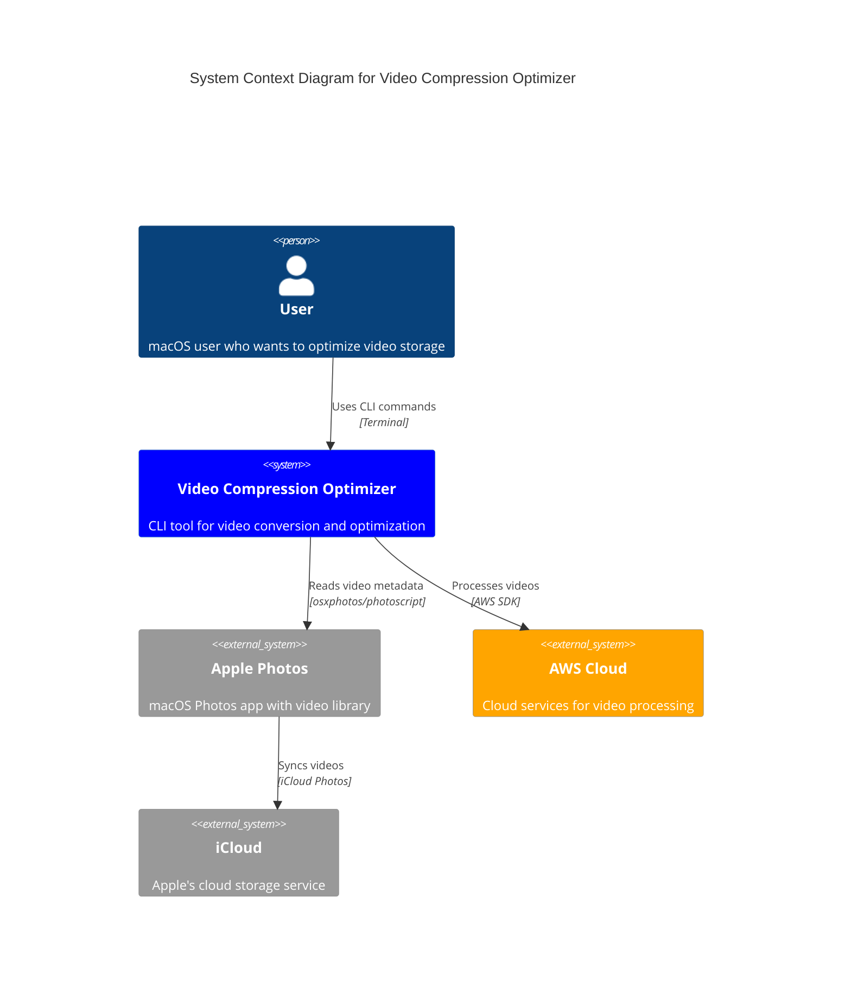
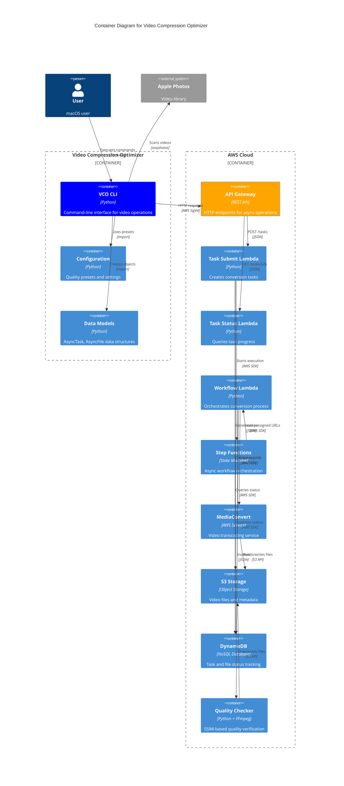
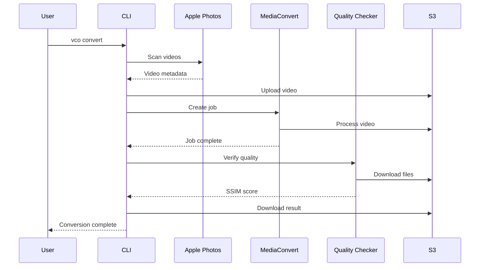
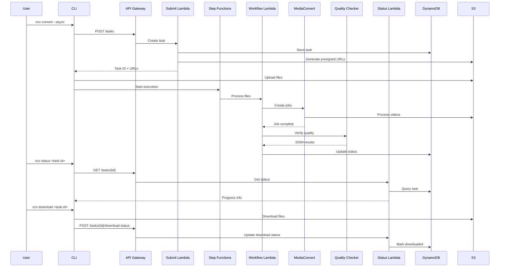
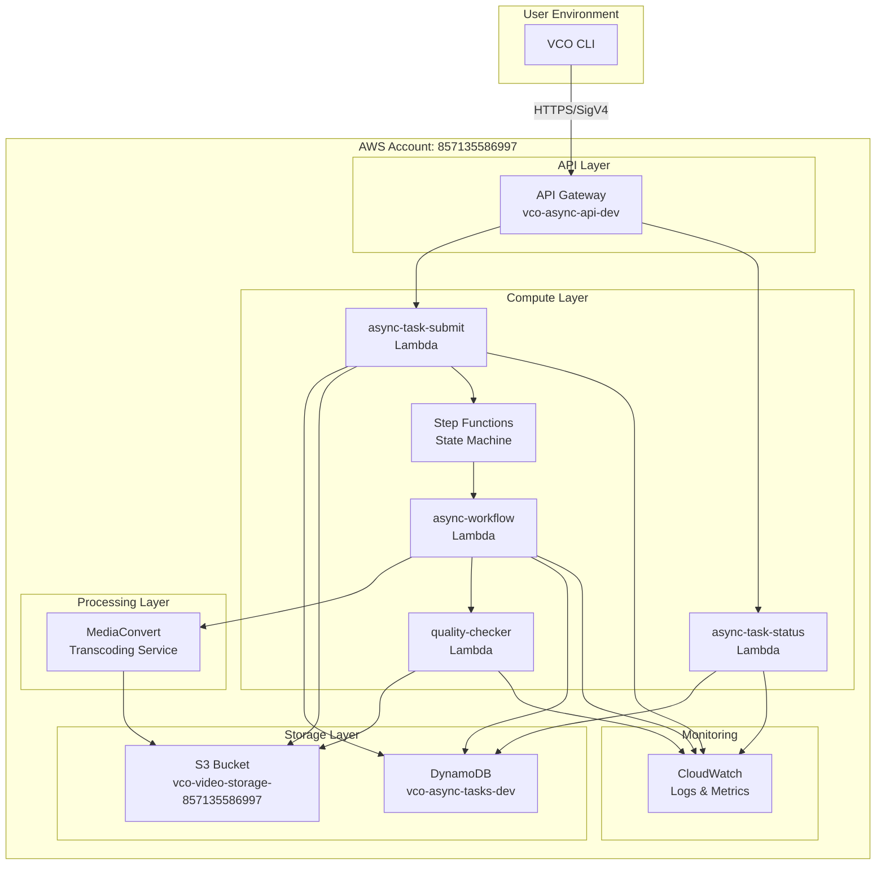
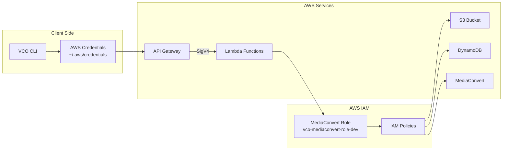
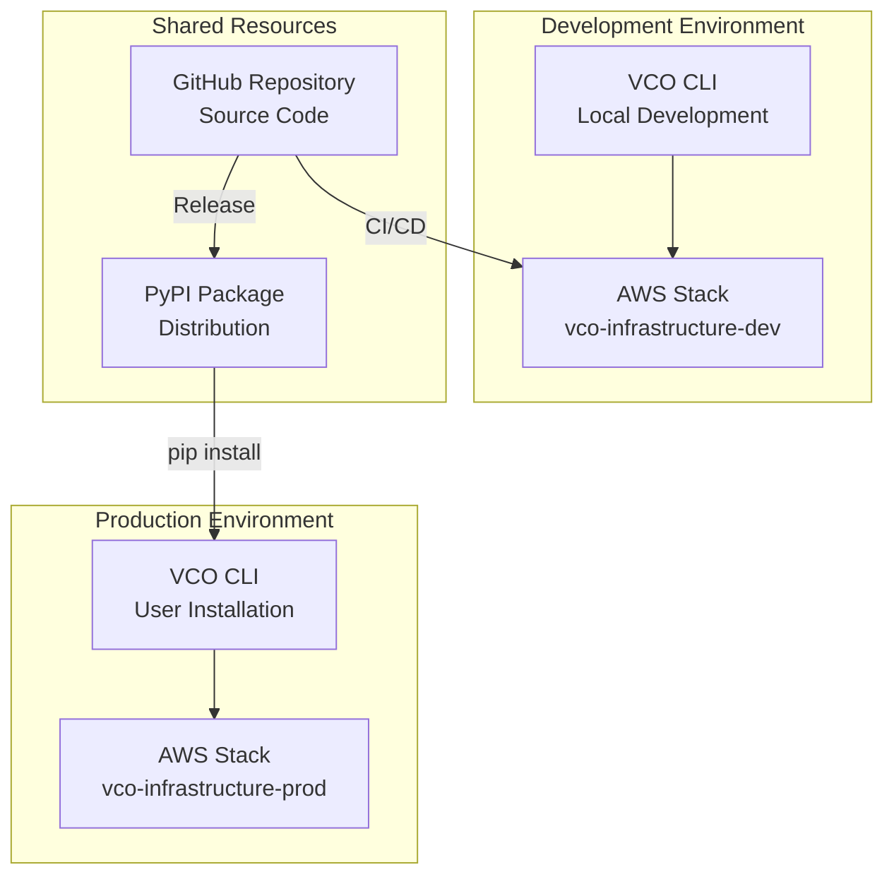
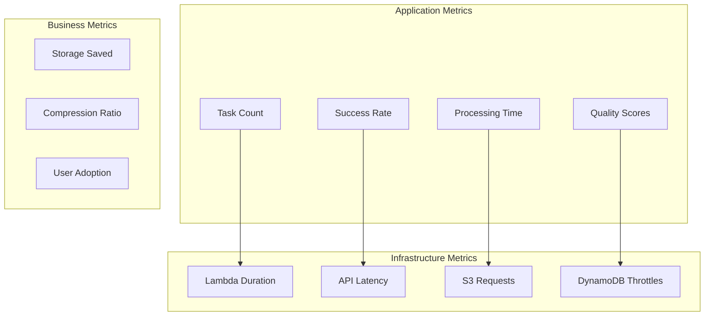

# Video Compression Optimizer - Architecture Documentation

## Overview

Video Compression Optimizer (VCO) は、Apple Photos の動画を H.265 形式に変換してストレージ容量を削減するツールです。同期処理と非同期処理の両方をサポートし、AWS クラウドサービスを活用した高品質な動画変換を提供します。

## C4 Model Level 1: System Context

### External Dependencies

| System | Purpose | Interface |
|--------|---------|-----------|
| **Apple Photos** | Video library access | osxphotos library |
| **AWS Cloud** | Video processing infrastructure | AWS SDK (boto3) |
| **iCloud** | Video storage and sync | Photos app integration |

## C4 Model Level 2: Container Diagram

### Container Responsibilities

| Container | Primary Responsibility | Technology Stack |
|-----------|----------------------|------------------|
| **VCO CLI** | User interface, local operations | Python 3.11, Rich, Click |
| **API Gateway** | HTTP endpoint management | AWS API Gateway, IAM auth |
| **Lambda Functions** | Serverless business logic | Python 3.11, boto3 |
| **Step Functions** | Workflow orchestration | AWS Step Functions |
| **MediaConvert** | Video transcoding | AWS MediaConvert |
| **S3 Storage** | File storage | AWS S3 |
| **DynamoDB** | State management | AWS DynamoDB |

## Data Flow Diagrams

### Synchronous Conversion Flow

### Asynchronous Conversion Flow

## AWS Service Architecture

### Infrastructure Components

### Resource Configuration

| Resource | Configuration | Purpose |
|----------|---------------|---------|
| **S3 Bucket** | `vco-video-storage-857135586997` | Video file storage with lifecycle rules |
| **DynamoDB Table** | `vco-async-tasks-dev` | Task state with TTL (90 days) |
| **Lambda Memory** | 256MB - 10GB | Based on processing requirements |
| **API Gateway** | REST API with IAM auth | Secure HTTP endpoints |
| **Step Functions** | Express workflow | Fast async orchestration |

## Security Architecture

### Authentication & Authorization

### Security Boundaries

| Boundary | Protection Method | Scope |
|----------|------------------|-------|
| **Network** | HTTPS/TLS 1.2+ | All API communications |
| **Authentication** | AWS SigV4 | API Gateway endpoints |
| **Authorization** | IAM roles/policies | Service-to-service access |
| **Data Encryption** | AES-256 | S3 objects, DynamoDB records |
| **Access Control** | Least privilege | Lambda execution roles |

## Deployment Architecture

### Environment Configuration

### Deployment Process

| Stage | Tool | Target | Validation |
|-------|------|--------|------------|
| **Build** | SAM CLI | Local | Unit tests, linting |
| **Deploy** | SAM Deploy | AWS CloudFormation | Integration tests |
| **Package** | pip/setuptools | PyPI | End-to-end tests |
| **Monitor** | CloudWatch | Production | Health checks |

## Performance & Scalability

### Processing Capacity

| Component | Limit | Scaling Method |
|-----------|-------|----------------|
| **API Gateway** | 10,000 RPS | Auto-scaling |
| **Lambda Concurrent** | 1,000 executions | Reserved concurrency |
| **MediaConvert** | 20 concurrent jobs | Queue management |
| **S3 Transfer** | 5GB per file | Multipart upload |
| **DynamoDB** | On-demand | Auto-scaling |

### Quality Presets Performance

| Preset | Processing Time | Quality Score | Use Case |
|--------|----------------|---------------|----------|
| **compression** | ~0.3x duration | SSIM ≥ 0.85 | Maximum compression |
| **balanced** | ~0.5x duration | SSIM ≥ 0.95 | Recommended default |
| **high** | ~0.8x duration | SSIM ≥ 0.98 | Quality priority |
| **balanced+** | ~0.8x duration | Best effort | Adaptive quality |

## Monitoring & Observability

### CloudWatch Metrics

### Log Aggregation

| Service | Log Level | Retention | Purpose |
|---------|-----------|-----------|---------|
| **Lambda Functions** | INFO | 30 days | Execution traces |
| **API Gateway** | ERROR | 30 days | Request/response logs |
| **Step Functions** | ALL | 30 days | Workflow execution |
| **MediaConvert** | INFO | 7 days | Job status |

## Disaster Recovery

### Backup Strategy

| Component | Backup Method | RTO | RPO |
|-----------|---------------|-----|-----|
| **DynamoDB** | Point-in-time recovery | < 1 hour | < 1 minute |
| **S3 Objects** | Cross-region replication | < 15 minutes | < 1 minute |
| **Lambda Code** | Version control | < 30 minutes | 0 (immutable) |
| **Configuration** | Infrastructure as Code | < 1 hour | 0 (version controlled) |

### Recovery Procedures

1. **Service Outage**: Automatic failover to backup region
2. **Data Corruption**: Point-in-time recovery from DynamoDB
3. **Code Issues**: Rollback to previous Lambda version
4. **Infrastructure**: Redeploy from CloudFormation template

## Cost Optimization

### Resource Utilization

| Service | Cost Driver | Optimization Strategy |
|---------|-------------|----------------------|
| **MediaConvert** | Processing minutes | Batch processing, quality presets |
| **Lambda** | Execution time | Memory optimization, cold start reduction |
| **S3** | Storage + requests | Lifecycle policies, intelligent tiering |
| **DynamoDB** | Read/write capacity | On-demand billing, TTL cleanup |

### Estimated Monthly Costs

| Usage Scenario | MediaConvert | Lambda | S3 | DynamoDB | Total |
|----------------|--------------|--------|----|---------|----|
| **Light (10 videos/month)** | $2 | $1 | $1 | $1 | $5 |
| **Medium (100 videos/month)** | $20 | $5 | $5 | $3 | $33 |
| **Heavy (1000 videos/month)** | $200 | $25 | $25 | $10 | $260 |

## Future Architecture Considerations

### Planned Enhancements

1. **Multi-region Support**: Deploy to multiple AWS regions for global users
2. **Batch Processing**: Optimize for large-scale video processing
3. **Real-time Notifications**: WebSocket support for live progress updates
4. **Advanced Analytics**: Machine learning for quality prediction
5. **Mobile Support**: iOS/Android companion apps

### Scalability Roadmap

| Phase | Target Scale | Key Changes |
|-------|-------------|-------------|
| **Phase 1** | 1K users | Current architecture |
| **Phase 2** | 10K users | Multi-region deployment |
| **Phase 3** | 100K users | Microservices architecture |
| **Phase 4** | 1M users | Event-driven architecture |

---

## References

- [AWS Well-Architected Framework](https://aws.amazon.com/architecture/well-architected/)
- [C4 Model Documentation](https://c4model.com/)
- [AWS MediaConvert User Guide](https://docs.aws.amazon.com/mediaconvert/)
- [Project Repository](https://github.com/eijikominami/video-compression-optimizer)
