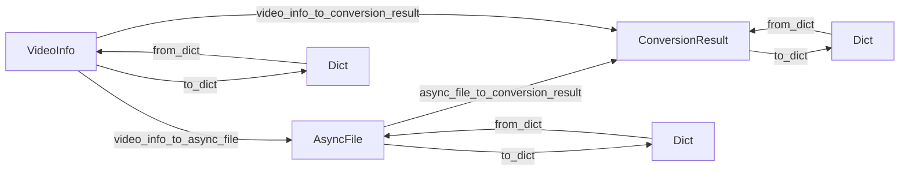

# データモデル仕様書

## 概要

Video Compression Optimizer (VCO) のデータモデル仕様を定義します。全てのビデオメタデータモデルは統一された基底クラス `BaseVideoMetadata` から継承し、データ整合性と型安全性を確保しています。

## 基底クラス

### BaseVideoMetadata

全てのビデオメタデータの基底クラス。共通フィールドと統一されたシリアライゼーション機能を提供します。

**ファイル**: `src/vco/models/base.py`

#### フィールド定義

| フィールド | 型 | 必須 | デフォルト | 説明 |
|-----------|-----|------|-----------|------|
| `uuid` | `str` | ○ | `""` | ビデオの一意識別子 |
| `filename` | `str` | ○ | `""` | 元のファイル名 |
| `file_size` | `int` | ○ | `0` | ファイルサイズ（バイト） |
| `capture_date` | `datetime \| None` | - | `None` | 撮影日時 |
| `location` | `tuple[float, float] \| None` | - | `None` | GPS座標 (緯度, 経度) |

#### 制約

- `uuid`: 空文字列不可
- `filename`: 空文字列不可
- `file_size`: 正の整数
- `location`: 緯度 -90〜90、経度 -180〜180

#### メソッド

```python
def to_dict(self) -> dict[str, Any]:
    """辞書形式に変換"""

@classmethod
def from_dict(cls, data: dict[str, Any]) -> 'BaseVideoMetadata':
    """辞書から復元"""
```

## 継承モデル

### VideoInfo

Apple Photos ライブラリからの動画情報。

**ファイル**: `src/vco/models/types.py`  
**継承**: `BaseVideoMetadata`

#### 追加フィールド

| フィールド | 型 | デフォルト | 説明 |
|-----------|-----|-----------|------|
| `path` | `Path` | `Path()` | 動画ファイルのパス |
| `codec` | `str` | `""` | 動画コーデック (h264, hevc等) |
| `resolution` | `tuple[int, int]` | `(0, 0)` | 解像度 (幅, 高さ) |
| `bitrate` | `int` | `0` | ビットレート (bps) |
| `duration` | `float` | `0.0` | 再生時間（秒） |
| `frame_rate` | `float` | `0.0` | フレームレート (fps) |
| `creation_date` | `datetime` | `datetime.now()` | ファイル作成日時 |
| `albums` | `list[str]` | `[]` | 所属アルバム名 |
| `is_in_icloud` | `bool` | `False` | iCloud 保存状態 |
| `is_local` | `bool` | `True` | ローカル利用可能状態 |

#### 使用例

```python
video = VideoInfo(
    uuid="ABC123",
    filename="video.mov",
    file_size=1024000,
    path=Path("/path/to/video.mov"),
    codec="h264",
    resolution=(1920, 1080),
    duration=120.5
)
```

### AsyncFile

非同期ワークフロー内の個別ファイル。

**ファイル**: `src/vco/models/async_task.py`  
**継承**: `BaseVideoMetadata`

#### 追加フィールド

| フィールド | 型 | デフォルト | 説明 |
|-----------|-----|-----------|------|
| `file_id` | `str` | `""` | ファイル固有ID (UUID v4) |
| `source_s3_key` | `str` | `""` | アップロード先S3キー |
| `output_s3_key` | `str \| None` | `None` | 変換後S3キー |
| `metadata_s3_key` | `str \| None` | `None` | メタデータS3キー |
| `status` | `FileStatus` | `PENDING` | 処理状態 |
| `mediaconvert_job_id` | `str \| None` | `None` | MediaConvert ジョブID |
| `quality_result` | `dict \| None` | `None` | 品質検証結果 |
| `error_code` | `int \| None` | `None` | エラーコード |
| `error_message` | `str \| None` | `None` | エラーメッセージ |
| `retry_count` | `int` | `0` | リトライ回数 |
| `preset_attempts` | `list[str]` | `[]` | 試行プリセット履歴 |
| `output_size_bytes` | `int \| None` | `None` | 変換後ファイルサイズ |
| `output_checksum` | `str \| None` | `None` | 出力ファイルチェックサム |
| `checksum_algorithm` | `str` | `"ETag"` | チェックサムアルゴリズム |
| `downloaded_at` | `datetime \| None` | `None` | ダウンロード完了日時 |
| `download_available` | `bool` | `False` | ダウンロード可能状態 |

#### FileStatus 列挙型

```python
class FileStatus(Enum):
    PENDING = "PENDING"           # 処理待ち
    CONVERTING = "CONVERTING"     # 変換中
    VERIFYING = "VERIFYING"       # 品質検証中
    COMPLETED = "COMPLETED"       # 完了
    DOWNLOADED = "DOWNLOADED"     # ダウンロード済み
    FAILED = "FAILED"            # 失敗
```

#### 後方互換性

```python
@property
def original_uuid(self) -> str:
    """uuid フィールドのエイリアス（後方互換性）"""
    return self.uuid
```

### ConversionResult

動画変換結果。

**ファイル**: `src/vco/services/convert.py`  
**継承**: `BaseVideoMetadata`

#### 追加フィールド

| フィールド | 型 | デフォルト | 説明 |
|-----------|-----|-----------|------|
| `success` | `bool` | `False` | 変換成功状態 |
| `original_path` | `Path` | `Path()` | 元ファイルパス |
| `converted_path` | `Path \| None` | `None` | 変換後ファイルパス |
| `quality_result` | `QualityResult \| None` | `None` | 品質検証結果 |
| `metadata` | `VideoMetadata \| None` | `None` | 保持メタデータ |
| `error_message` | `str \| None` | `None` | エラーメッセージ |
| `mediaconvert_job_id` | `str \| None` | `None` | MediaConvert ジョブID |
| `quality_job_id` | `str \| None` | `None` | 品質チェックジョブID |
| `best_effort` | `bool` | `False` | ベストエフォートモード使用 |
| `selected_preset` | `str \| None` | `None` | 選択されたプリセット |

## データ変換

### 変換関数

**ファイル**: `src/vco/models/converters.py`

#### 主要変換関数

```python
def video_info_to_async_file(video: VideoInfo, file_id: str | None = None) -> AsyncFile:
    """VideoInfo -> AsyncFile 変換"""

def async_file_to_conversion_result(async_file: AsyncFile, original_path: Path) -> ConversionResult:
    """AsyncFile -> ConversionResult 変換"""

def video_info_to_conversion_result(video: VideoInfo, success: bool = False, 
                                  error_message: str | None = None) -> ConversionResult:
    """VideoInfo -> ConversionResult 変換"""
```

#### 変換マッピング

| 変換先 | 変換元（優先1） | 変換元（優先2） | 欠損時 |
|--------|---------------|---------------|--------|
| `uuid` | `original_uuid` | `uuid` | エラー |
| `file_size` | `file_size` | `source_size_bytes` | 0 |
| `capture_date` | `capture_date` | - | `None` |
| `location` | `location` | - | `None` |

## バリデーション

### バリデーション関数

**ファイル**: `src/vco/models/validators.py`

```python
def validate_base_metadata(metadata: BaseVideoMetadata) -> None:
    """基底メタデータの検証"""
```

#### 検証ルール

| フィールド | 検証内容 | エラーメッセージ |
|-----------|---------|----------------|
| `uuid` | 非空文字列 | "uuid is required and cannot be empty" |
| `filename` | 非空文字列 | "filename is required and cannot be empty" |
| `file_size` | 正の整数 | "file_size must be positive" |
| `location` | 座標範囲 | "latitude must be between -90 and 90" |

## データフロー



## エラーハンドリング

### バリデーションエラー

```python
try:
    validate_base_metadata(metadata)
except ValueError as e:
    # 具体的なエラーメッセージで処理
    logger.error(f"Validation failed: {e}")
```

### 変換エラー

```python
try:
    result = video_info_to_async_file(video)
except (KeyError, TypeError) as e:
    # 必須フィールド不足や型不整合
    logger.error(f"Conversion failed: {e}")
```

## 使用例

### 基本的な使用パターン

```python
# 1. VideoInfo から AsyncFile への変換
video = VideoInfo(uuid="123", filename="test.mov", file_size=1000)
async_file = video_info_to_async_file(video, "file-456")

# 2. バリデーション
validate_base_metadata(async_file)

# 3. シリアライゼーション
data = async_file.to_dict()
restored = AsyncFile.from_dict(data)

# 4. ConversionResult への変換
result = async_file_to_conversion_result(async_file, Path("/original.mov"))
```

## 変更履歴

| バージョン | 日付 | 変更内容 |
|-----------|------|---------|
| 1.0.0 | 2026-01-01 | 初版作成。BaseVideoMetadata 基底クラス導入、統一されたデータモデル設計 |

## 関連ドキュメント

- [API 仕様書](api-specification.md)
- [アーキテクチャ図](architecture.md)
- [開発ガイドライン](../.kiro/steering/development-guidelines.md)
